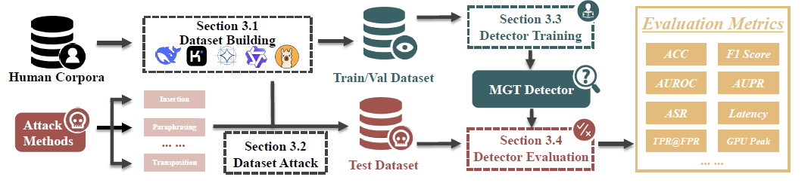

# MGTEval



<p align="center">
  <a href="./README.md"><strong>English</strong></a> |
  <a href="./README.zh.md"><strong>中文</strong></a>
</p>

**Promo Video**: [https://www.youtube.com/watch?v=1CVoGQFW4KU](https://www.youtube.com/watch?v=1CVoGQFW4KU)  
**Project Website**: [http://uncoverai.cn](http://uncoverai.cn)

This is the official repo of our `ACL 2026 Demo` submission `MGTEval: An Interactive Platform for Systematic Evaluation of Machine-Generated Text Detectors` and `ICLR 2026` paper [Learning From Dictionary: Enhancing Robustness of Machine-Generated Text Detection in Zero-Shot Language via Adversarial Training](https://openreview.net/forum?id=bTcFHJo1Zk).
For the implementation of our ICLR 2026 method **TASTE**, please navigate to [`src/detectors/finetuned/TASTE/README.md`](src/detectors/finetuned/TASTE/README.md).
This repo introduces MGTEval, an interactive platform for systematic evaluation of machine-generated text detectors. It covers dataset building, dataset attack, detector training, and performance evaluation in one workflow.
This work was primarily completed at Xi’an Jiaotong University (XJTU) by `Yuanfan Li` and `Qi Zhou` under the supervision of Professor `Xiaoming Liu`.

---

## Table of Contents

- [Features / 特性](#features)
- [Introduction / 引言](#introduction)
- [Supported detectors / 支持的检测器](#supported-detectors)
- [Quick Start / 快速开始](#quick-start)
- [Workflow and examples / 工作流与示例](#workflow-and-examples)
- [License / 许可证](#license)
- [Citation / 引用](#citation)

---

## Features

- **Unified pipeline**: Dataset building, dataset attack, detector training, and performance evaluation in one end-to-end workflow.  
- **Detector zoo**: 25+ detectors across metric-based and model-based families, including Binoculars, DetectGPT, GLTR, Fast DetectGPT, DNAGPT, DeTeCtive, MPU, PECOLA, TASTE, etc.  
- **Comprehensive attacks**: 12+ text attack families such as span perturbation, paraphrase, typo variants, synonym substitution, back translation, and humanization.  
- **Rich evaluation metrics**: Accuracy, F1, AUROC, AUPR, ECE, Brier score, TPR@FPR, risk-coverage, bootstrap CI, and ASR-based robustness analysis.  
- **Fine-grained analysis**: Per-language, per-domain, per-model, and per-length breakdowns with curves/figures and prediction-level artifacts.  
- **Flexible execution**: Command-line and interactive Web UI with real-time WebSocket logs for Build, Attack, Train, Detect, and Demo workflows.  
- **Practical model access**: Hugging Face, local checkpoints, mirror endpoints, and ModelScope cache support for training and inference.  
- **Reproducible outputs**: Auto-saved run configs, manifests, summaries, checkpoints, curves, plots, and structured JSON artifacts for auditability.

## Introduction
We present MGTEVAL, an extensible platform for systematic evaluation of MachineGenerated Text (MGT) detectors. Despite
rapid progress in MGT detection, existing evaluations are often fragmented across datasets,
preprocessing, attacks, and metrics, making results hard to compare and reproduce. MGTEVAL organizes the workflow into four components: Dataset Building, Dataset Attack, Detector Training, and Performance Evaluation. It supports constructing custom benchmarks by generating MGT with configurable
LLMs, applying 12 text attacks to test sets,
training detectors via a unified interface, and
reporting effectiveness, robustness, and efficiency. The platform provides both commandline and Web-based interfaces for user-friendly
experimentation without code rewriting.

---

## Supported detectors

### Metric based detectors

| Detector | Key | Paper | Venue | Link | Introduction |
|---|---|---|---|---|---|
| Binoculars | binoculars | Spotting LLMs With Binoculars: Zero-Shot Detection of Machine-Generated Text | ICML 2024 | [link](https://arxiv.org/abs/2401.12070) | Compares cross-perplexity between two LLMs (an 'observer' and a 'performer') to zero-shot identify machine-generated passages. |
| DetectGPT | detectgpt | DetectGPT: Zero-Shot Machine-Generated Text Detection using Probability Curvature | ICML 2023 (Oral) | [link](https://arxiv.org/abs/2301.11305) | Perturbs input text and measures probability curvature — machine-generated text tends to occupy local maxima in log-probability space. |
| DNA-DetectLLM | dnadetectllm | DNA-DetectLLM: Unveiling AI-Generated Text via a DNA-Inspired Mutation-Repair Paradigm | NIPS 2025 (Spotlight) | [link](https://openreview.net/forum?id=yQoHUijSHx) | Applies a DNA-inspired mutation-repair paradigm: mutates text tokens and observes how well a language model 'repairs' them to distinguish human from AI text. |
| DNA-GPT | dnagpt | DNA-GPT: Divergent N-Gram Analysis for Training-Free Detection of GPT-Generated Text | ICLR 2024 | [link](https://arxiv.org/abs/2305.17359) | Detects GPT-generated text through divergent N-gram analysis — comparing N-gram divergence patterns between the original and re-generated versions. |
| Entropy | entropy | N/A | N/A | N/A | Measures average prediction entropy at each token position — machine-generated text often shows lower entropy patterns. |
| Fast-DetectGPT | fastdetectgpt | Fast-DetectGPT: Efficient Detection of Machine-Generated Text via Sampling Discrepancy | ICLR 2024 | [link](https://arxiv.org/abs/2310.05130) | Accelerates DetectGPT by replacing expensive perturbation sampling with conditional probability curvature estimation via a single forward pass. |
| GLTR | gltr | GLTR: Statistical Detection and Visualization of Generated Text | ACL 2019 | [link](https://arxiv.org/abs/1906.04043) | Visualizes and aggregates per-token rank statistics (top-k bucket counts) from a language model to distinguish human from machine text. |
| LASTDE | lastde | Training-free LLM-generated Text Detection by Mining Token Probability Sequences | ICLR 2025 | [link](https://openreview.net/forum?id=vo4AHjowKi) | Mines token probability sequences to detect LLM-generated text without any fine-tuning, using statistical patterns in probability distributions. |
| LASTDE++ | lastdepp | Training-free LLM-generated Text Detection by Mining Token Probability Sequences | ICLR 2025 | [link](https://openreview.net/forum?id=vo4AHjowKi) | An enhanced version of LASTDE with improved probability sequence mining and additional statistical features for stronger detection. |
| Likelihood | likelihood | N/A | N/A | N/A | Computes the average log-probability of each token under a reference language model as a baseline detection signal. |
| LogRank | logrank | N/A | N/A | N/A | Applies a logarithmic transform to per-token ranks before averaging, providing a more robust baseline metric than raw rank. |
| LRR | lrr | DetectLLM: Leveraging Log Rank Information for Zero-Shot Detection of Machine-Generated Text | EMNLP 2023 Findings | [link](https://arxiv.org/abs/2306.05540) | Combines log-likelihood with log-rank information to zero-shot detect machine text, exploiting complementary statistical signals. |
| NPR | npr | DetectLLM: Leveraging Log Rank Information for Zero-Shot Detection of Machine-Generated Text | EMNLP 2023 Findings | [link](https://arxiv.org/abs/2306.05540) | Normalizes prediction probability ratios across nested contexts to detect machine text without any training. |
| RAIDAR | raidar | Raidar: geneRative AI Detection viA Rewriting | ICLR 2024 | [link](https://arxiv.org/abs/2401.12970) | Detects AI-generated text by rewriting the input and comparing semantic similarity — human text changes more substantially when rewritten. |
| Rank | rank | N/A | N/A | N/A | Uses the average prediction rank of each token as a detection statistic — machine text tends to have lower (better) average ranks. |
| TOCSIN | tocsin | Zero-Shot Detection of LLM-Generated Text using Token Cohesiveness | EMNLP 2024 | [link](https://arxiv.org/abs/2409.16914) | Zero-shot detector that measures token cohesiveness — the consistency of token-level predictions — to identify LLM-generated text. |

### Model based detectors

| Detector | Key | Paper | Venue | Link | Introduction |
|---|---|---|---|---|---|
| CoCo | coco | CoCo: Coherence-Enhanced Machine-Generated Text Detection Under Low Resource With Contrastive Learning | EMNLP 2023 | [link](https://aclanthology.org/2023.emnlp-main.1005/) | Enhances detection under low-resource settings by incorporating text coherence signals into a contrastive learning framework. |
| DeTeCtive | detective | DeTeCtive: Detecting AI-generated Text via Multi-Level Contrastive Learning | NIPS 2024 | [link](https://arxiv.org/abs/2410.13964) | Employs multi-level contrastive learning (word, sentence, document) to learn fine-grained representations for AI text detection. |
| Finetuned Detector | finetuned | N/A | N/A | N/A | Loads a locally fine-tuned classification checkpoint as a detector — supports any HuggingFace-compatible model. |
| GREATER | greater | Iron Sharpens Iron: Defending Against Attacks in Machine-Generated Text Detection with Adversarial Training | ACL 2025 | [link](https://arxiv.org/abs/2502.12734) | Applies adversarial training to harden machine text detectors against text perturbation attacks — the 'Iron Sharpens Iron' approach. |
| Longformer | longformer | Longformer: Long-Document Transformer | N/A | N/A | Uses the Longformer architecture with global attention to classify long documents as human or machine-generated. |
| MPU | mpu | Multiscale Positive-Unlabeled Detection of AI-Generated Texts | ICLR 2024 (Spotlight) | [link](https://arxiv.org/abs/2305.18149) | Tackles short-text detection through multiscale positive-unlabeled learning, effective even without labeled negative examples. |
| PECOLA | pecola | Does DETECTGPT Fully Utilize Perturbation? Bridging Selective Perturbation to Fine-tuned Contrastive Learning Detector would be Better | ACL 2024 | [link](https://arxiv.org/abs/2402.00263) | Bridges selective perturbation with fine-tuned contrastive learning, improving upon DetectGPT's perturbation utilization. |
| RADAR | radar | RADAR: Robust AI-Text Detection via Adversarial Learning | NIPS 2023 | [link](https://arxiv.org/abs/2307.03838) | Trains a paraphrase detector jointly with a paraphrase generator to build robustness against common evasion attacks. |
| TASTE | taste | Learning From Dictionary: Enhancing Robustness of Machine-Generated Text Detection in Zero-Shot Language via Adversarial Training | ICLR 2026 | [link](https://openreview.net/forum?id=bTcFHJo1Zk) | Enhances cross-lingual robustness of MGT detection via dictionary-driven adversarial training. Uses mBERT as the target detector and GPT-2 as a surrogate model. Training uses English data only; multilingual datasets (ar/zh/de/ru) are for evaluation. |

---

## Quick Start

### Setup with conda
Step 1 Create a new environment
```bash
conda create -n mgteval python=3.12 -y
```

Step 2 Activate the environment
```bash
conda activate mgteval
```

Step 3 Upgrade pip
```bash
pip install -U pip
```

Step 4 Install MGTEval in editable mode
```bash
pip install -e .
```

Step 5 Verify the installation
```bash
mgteval-cli --help
mgteval-cli list
```

Step 6 Start Server
```bash
./start_dev.sh
```

### Setup with venv
Step 1 Create a virtual environment
```bash
python -m venv .venv
```

Step 2 Activate the environment
```bash
source .venv/bin/activate
```

Step 3 Upgrade pip
```bash
pip install -U pip
```

Step 4 Install MGTEval in editable mode
```bash
pip install -e .
```

Step 5 Verify the installation
```bash
mgteval-cli --help
mgteval-cli list
```

---

## Workflow and examples

This section explains the full pipeline from data construction to evaluation. Use the example YAML files in the examples directory. The commands below reference those files without repeating their contents.

### Step 1 Build a dataset from human text
Use the build subcommand with the example file to generate machine text from human prompts.

Example file
- examples/build/build_dataset.yaml

Command
```bash
mgteval-cli build examples/build/build_dataset.yaml
```

What this step does
- Reads human text from the input dataset
- Builds prompts from the selected label
- Generates machine text with the configured backend
- Writes a paired dataset with human and machine records

### Step 2 Apply attacks to an existing dataset
Use the attack subcommand with the example file to perturb an existing dataset.

Example file
- examples/attack/build_attack_dataset.yaml

Command
```bash
mgteval-cli attack examples/attack/build_attack_dataset.yaml
```

What this step does
- Loads the dataset produced in step 1 or any existing dataset
- Applies a selected set of text attacks from the attack config
- Writes an attacked dataset for robustness evaluation

### Step 3 Train a detector with datasets
Choose one branch to follow first. You can return to the other branch later.

Branch A Metric based training
Example file
- examples/train/binoculars.yaml
Command
```bash
mgteval-cli train examples/train/binoculars.yaml
```

What this step does
- Runs the detector on training data
- Fits a calibrator to map scores to probabilities
- Saves calibration outputs for later evaluation

Branch B Model based training
Example file
- examples/train/coco.yaml

Command
```bash
mgteval-cli train examples/train/coco.yaml
```
What this step does
- Fine tunes the detector on the training dataset
- Saves checkpoints and training summaries

### Step 4 Detect datasets with the trained detector
Use the detection branch that matches the training branch you chose.

Branch A Metric based detection

Example file
- examples/detect/binoculars.yaml

Command
```bash
mgteval-cli detect examples/detect/binoculars.yaml
```

What this step does
- Runs evaluation on the test dataset
- Produces metrics and curves
- Can evaluate on attacked datasets if configured

Branch B Model based detection

Example file
- examples/detect/coco.yaml

Command
```bash
mgteval-cli detect examples/detect/coco.yaml
```

What this step does
- Loads the trained checkpoint
- Evaluates on the test dataset
- Produces metrics and curves

---

## License

This repository is licensed under the [Apache-2.0 License](https://www.apache.org/licenses/LICENSE-2.0).

## Citation

If you find our `TASTE` detector work is helpful, please kindly cite as:

```text
@inproceedings{
    li2026learning,
    title={Learning From Dictionary: Enhancing Robustness of Machine-Generated Text Detection in Zero-Shot Language via Adversarial Training},
    author={Yuanfan Li and Qi Zhou and Zexuan Xie},
    booktitle={The Fourteenth International Conference on Learning Representations},
    year={2026},
    url={https://openreview.net/forum?id=bTcFHJo1Zk}
}
```
