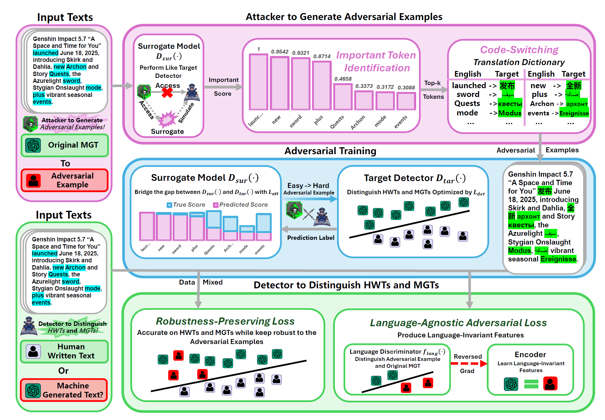

# TASTE in MGTEval

TASTE is our ICLR 2026 method, proposed in [Learning From Dictionary: Enhancing Robustness of Machine-Generated Text Detection in Zero-Shot Language via Adversarial Training](https://openreview.net/forum?id=bTcFHJo1Zk). The core idea is to improve cross-lingual robustness of machine-generated text detection through dictionary-driven adversarial training: the detector is trained on English data, while multilingual robustness is evaluated on zero-shot test sets and attacked variants.



This directory contains the integrated TASTE implementation for MGTEval, including the detector, training entrypoint, and built-in translation dictionaries.

## Installation

Install MGTEval first. The steps are the same as the main project README.

### Setup with conda

Step 1: create an environment
```bash
conda create -n mgteval python=3.12 -y
```

Step 2: activate it
```bash
conda activate mgteval
```

Step 3: upgrade pip
```bash
pip install -U pip
```

Step 4: install MGTEval in editable mode
```bash
pip install -e .
```

Step 5: verify the installation
```bash
mgteval --help
mgteval list
```

Step 6: start the Web UI
```bash
./start_dev.sh
```

### Setup with venv

Step 1: create a virtual environment
```bash
python -m venv .venv
```

Step 2: activate it
```bash
source .venv/bin/activate
```

Step 3: upgrade pip
```bash
pip install -U pip
```

Step 4: install MGTEval in editable mode
```bash
pip install -e .
```

Step 5: verify the installation
```bash
mgteval --help
mgteval list
```

Step 6: start the Web UI
```bash
./start_dev.sh
```

## Training TASTE

You can train TASTE in either of the following ways.

### Option A: train from the frontend

Start the MGTEval frontend:

```bash
./start_dev.sh
```

Then open the Web UI and go to the `Train Detector` page. Select `TASTE`, load or edit the template, and run training there directly.

### Option B: train from the command line

Run:

```bash
mgteval train examples/train/taste.yaml
```

The example config is:

- `examples/train/taste.yaml`

By default, TASTE uses:

- `model1`: `bert-base-multilingual-cased`
- `model2`: `gpt2`
- built-in dictionaries from `src/detectors/finetuned/TASTE/translation`

Training outputs are saved under the configured `output_dir`, for example:

- `models/runs_taste_YYYYMMDD-HHMMSS/`

## Evaluation

TASTE can also be evaluated directly from the frontend.

Start the MGTEval frontend:

```bash
./start_dev.sh
```

Then open the Web UI and go to the `Evaluate Detector` page. Select `TASTE`, choose the dataset and checkpoint, and run evaluation there.

You can also evaluate from the command line with:

```bash
mgteval detect examples/detect/taste.yaml
```

The example config is:

- `examples/detect/taste.yaml`

## Reproducing Our Experiments

To reproduce the released TASTE experiments, first download our pretrained checkpoint [here](https://drive.google.com/file/d/1w1hbdiZMS_JzPntVMWM3qrTQ4KxJf-t6/view?usp=sharing), and then unzip the packaged assets:

```bash
unzip TASTE.zip
```

This package includes:

- test datasets
- detector checkpoints
- attacked evaluation datasets

After unzipping, you can run detection directly from the command line:

```bash
mgteval detect examples/detect/taste.yaml
```

Or run the same evaluation directly from the frontend on the `Evaluate Detector` page.

The provided package is expected to supply the assets referenced by the example detect config, including:

- clean or original test set
- attacked test set
- released TASTE checkpoint

## Notes

- TASTE dictionaries are auto-loaded from this directory by default.
- The built-in dictionary path is `src/detectors/finetuned/TASTE/translation`.
- The integrated command aliases `mgteval`, `mgt_eval`, and `mgteval-cli` all point to the same CLI entrypoint.

## Citation

If you find our `TASTE` detector work is helpful, please kindly cite as:

```text
@inproceedings{
    li2026learning,
    title={Learning From Dictionary: Enhancing Robustness of Machine-Generated Text Detection in Zero-Shot Language via Adversarial Training},
    author={Yuanfan Li and Qi Zhou and Zexuan Xie},
    booktitle={The Fourteenth International Conference on Learning Representations},
    year={2026},
    url={https://openreview.net/forum?id=bTcFHJo1Zk}
}
```